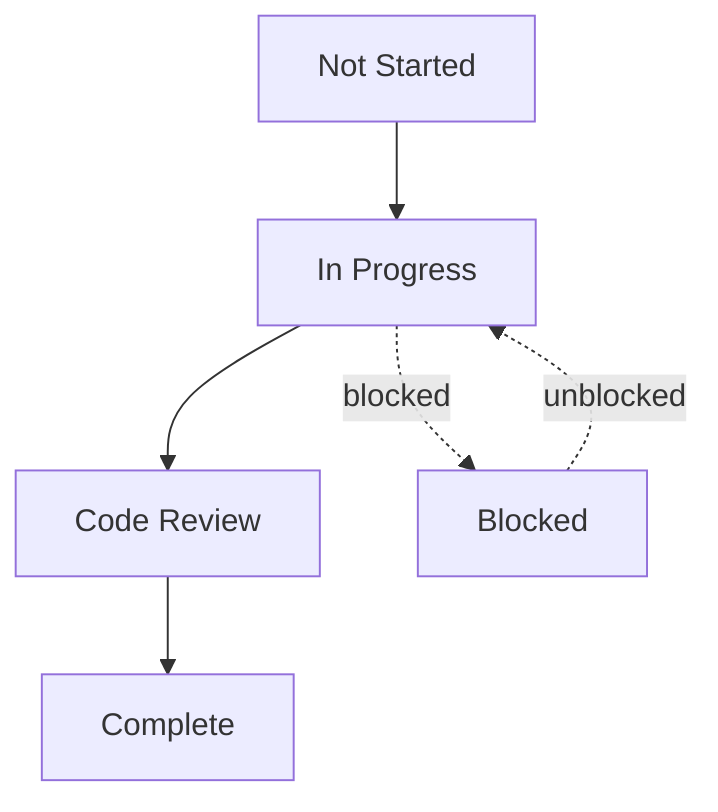

# Sprint 0: Project Setup

## 📅 Sprint Information

**Dates**: Week 1
**Duration**: 5 working days
**Status**: 🔴 Not Started
**Sprint Lead**: [Assignee]

## 🎯 Sprint Goals

### Primary Objectives

1. **Initialize Project Structure**
   - Create organized folder structure
   - Set up version control
   - Configure development environment

2. **Set Up Development Environment**
   - Configure Python backend (FastAPI)
   - Configure React frontend (Vite)
   - Set up Docker for local development

3. **Establish Documentation Framework**
   - Create comprehensive planning documents
   - Document technical decisions
   - Set up contribution guidelines

4. **Verify Tooling and Dependencies**
   - Test all required tools and libraries
   - Verify API access (Gemini)
   - Set up environment configuration

## ✅ Success Criteria

### Must-Have (P0)
- [x] Repository initialized with proper structure
- [ ] FastAPI server running locally
- [ ] React frontend running locally
- [ ] Docker Compose working for dev environment
- [ ] All documentation created
- [ ] Team can clone and run the project

### Nice-to-Have (P1)
- [ ] CI/CD pipeline configured
- [ ] Pre-commit hooks set up
- [ ] Automated tests running
- [ ] Development guide created

## 📋 Sprint Overview

### Tasks Breakdown

| Task | Priority | Est. Time | Status |
|------|----------|-----------|--------|
| t01-init-repo | High | 2h | Not Started |
| t02-setup-python | High | 3h | Not Started |
| t03-setup-frontend | High | 3h | Not Started |
| t04-docker-config | Medium | 2h | Not Started |
| t05-env-config | High | 2h | Not Started |
| t06-git-setup | Medium | 1h | Not Started |
| t07-documentation | High | 4h | Not Started |

**Total Estimated Time**: 17 hours (~2 days)

## 🔗 Dependencies

### Task Dependencies
```
t01-init-repo (must be first)
    ├─→ t02-setup-python
    ├─→ t03-setup-frontend
    ├─→ t04-docker-config
    ├─→ t05-env-config
    ├─→ t06-git-setup
    └─→ t07-documentation

t02-setup-python and t03-setup-frontend
    ├─→ t04-docker-config
    └─→ t05-env-config
```

### External Dependencies
- GitHub account and access
- Gemini API key
- Docker installed locally
- Python 3.11+ installed
- Node.js 18+ installed

## 🚀 Getting Started

### Before Sprint Start

1. **Prerequisites Checklist**
   - [ ] GitHub account with repo creation access
   - [ ] Google Cloud account with Gemini API access
   - [ ] Docker Desktop installed and running
   - [ ] Python 3.11+ installed
   - [ ] Node.js 18+ installed
   - [ ] VS Code or preferred IDE

2. **Account Setup**
   - [ ] Create GitHub repository
   - [ ] Generate Gemini API key
   - [ ] Set up GitHub Actions (if using)

### Sprint Kickoff

**Day 1** (4 hours):
- Team meeting: Sprint overview and task assignment
- t01-init-repo: Initialize repository structure
- t02-setup-python: Set up Python backend

**Day 2** (4 hours):
- t03-setup-frontend: Set up React frontend
- t05-env-config: Configure environment files

**Day 3** (4 hours):
- t04-docker-config: Docker configuration
- t06-git-setup: Git hooks and configuration

**Day 4** (4 hours):
- t07-documentation: Complete documentation

**Day 5** (1 hour):
- Sprint review and demo
- Retrospective
- Sprint 1 planning

## 📊 Progress Tracking

### Daily Standup Format

**Yesterday**: [What did you complete?]
**Today**: [What will you work on?]
**Blockers**: [What's blocking you?]

### Task Status



## 🎓 Learning Resources

### For New Team Members
- [FastAPI Tutorial](https://fastapi.tiangolo.com/tutorial/)
- [React Documentation](https://react.dev/)
- [Vite Guide](https://vitejs.dev/guide/)
- [Docker Documentation](https://docs.docker.com/)

### Tech Stack References
- [Tech Stack Document](../../tech-stack.md)
- [Architecture Document](../../architecture.md)
- [Project Overview](../../project-overview.md)

## ⚠️ Risks & Mitigation

### Risk 1: API Access Issues
**Risk**: Cannot get Gemini API key or access
**Probability**: Low
**Impact**: High
**Mitigation**: Apply early, have backup plan (mock responses)

### Risk 2: Environment Setup Problems
**Risk**: Local environment doesn't work for some team members
**Probability**: Medium
**Impact**: Medium
**Mitigation**: Docker ensures consistency, detailed setup guide

### Risk 3: Time Overrun
**Risk**: Tasks take longer than estimated
**Probability**: Medium
**Impact**: Low
**Mitigation**: Buffer time built in, can defer P1 tasks

## 📝 Notes

**Sprint 0 is all about foundation.** We're building the groundwork for all future sprints. Take time to do things right, but don't over-engineer. The goal is to get to a working development environment quickly.

**Key Focus Areas**:
1. **Clarity**: Clear folder structure and naming conventions
2. **Automation**: Automated setup wherever possible (Docker, scripts)
3. **Documentation**: Document decisions and setup processes
4. **Validation**: Test everything works before moving on

---

**Sprint Start Date**: [Date]
**Sprint End Date**: [Date]
**Daily Standup Time**: [Time]
**Sprint Review Date**: [Date]
**Sprint Review Time**: [Time]

**Last Updated**: 2024-02-27
**Sprint Status**: 🔴 Not Started
